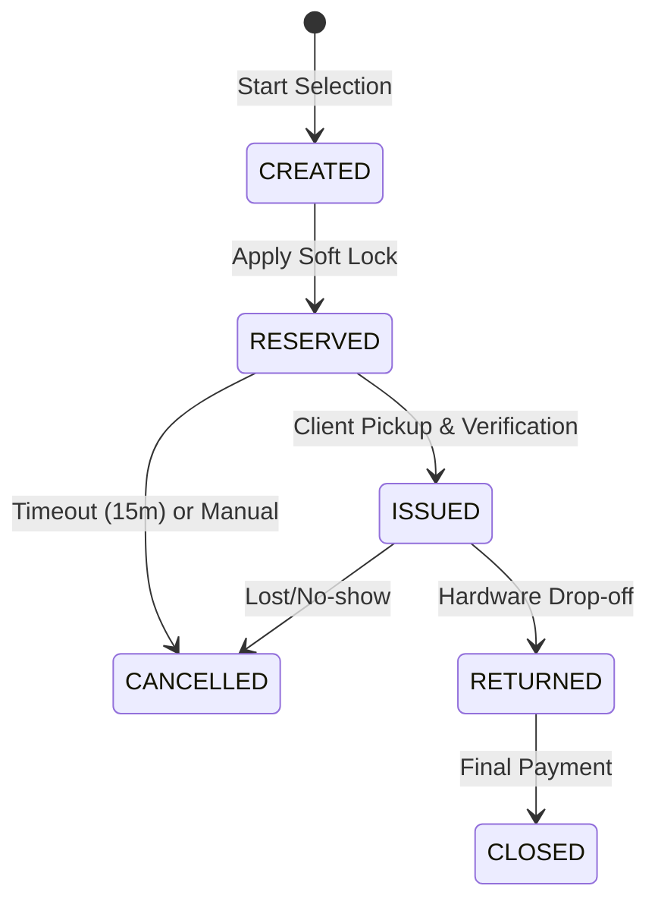

# 03. User Journeys and Lifecycle

## 1. Prime Rental Flow
1. **Search**: Renter filters by Branch and Category.
2. **Select**: Renter picks a Model (Price is pre-calculated).
3. **Reserve**: Renter initiates order. **Soft Lock** (15 min) is applied to specific Items.
4. **Visit**: Renter arrives at the Branch.
5. **Verify**: Staff checks ID and sets `is_verified = true` if necessary.
6. **Issue**: Staff marks order as `ISSUED`. Items status change to `RENTED`.

## 2. Return and Closing
1. **Return**: Renter returns items to ANY branch.
2. **Inspection**: Staff checks `Condition` (NEW, USED, DAMAGED).
3. **Closing**: Final payment calculation. Order marked `CLOSED`.

## 3. Order State Machine

